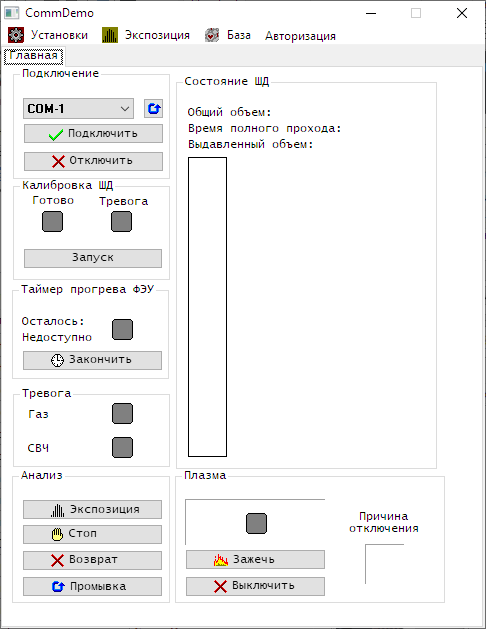

# Модуль общения для прибора (демо)

Репозиторий содержит часть программного обеспечения некоторого агрегата, относящуюсю к общению между его частями.
Программное обеспечение состоит из двух частей:
* "Прошивка" - часть, которая выполняется на микроконтроллерном модуле устройства и занимается обработкой внешних раздражителей (команд).
* "Интерфейс" - часть, которая выполняется на ПК, визуально отображает состояние устройства и позволяет всемогущей воле Пользователя управлять им.

Модуль общения соединяет эти две части через компактный протокол, найденный в интернете, пользуясь шнурком USB (который прикидывается COM-портом).

Авторы: Иван Л., Александр Х. 